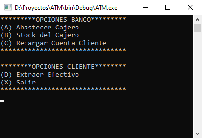
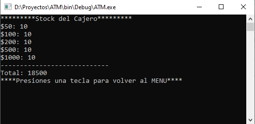
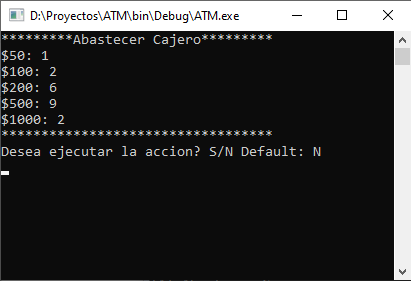
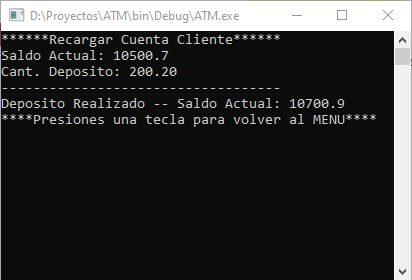
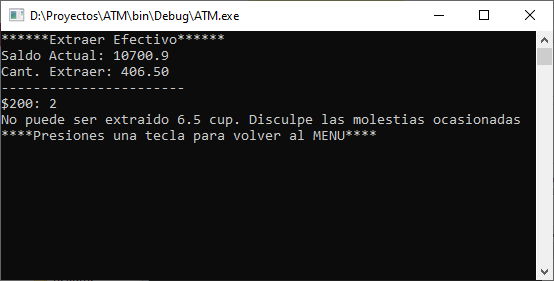
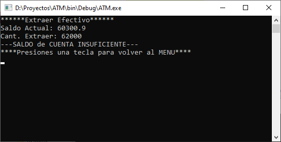
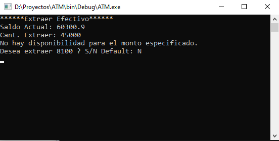
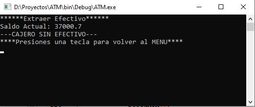

# ATM

Proyecto de Programación I. Facultad 4, Universidad de las Ciencias Informáticas. Año 2023

`Est. David Sardiñas Lima 4105`

Es una aplicación de Consola, que simula un cajero automático, desarrollada en el lenguaje C++.

## Menú Principal
Al iniciar imprime en pantalla un menú con dos secciones de opciones; las que supuestamente realiza un empleado del Banco y las que realiza un cliente de dicho Banco.
 
 El empleado del Banco puede:
 - Abastecer el Cajero: Al presionar la tecla `A`, se ejecuta el método `FeedATM();`.
 - Ver la disponibilidad de billetes en el cajero: Al presionar la tecla `B`, se ejecuta el método `StockATM();`.
 - Realizar un depósito en la cuenta del cliente: Al presionar la tecla `C`, se ejecuta el método `FeedClient();`
 
 El cliente del Banco puede:
 - Extraer Efectivo del cajero

## Las Opciones

>`menuATM()`: Imprime en pantalla un menú para navegar por las opciones del programa.

>`StockATM()`: Muestra la cantidad de billetes de cada denominación que hay en el cajero, y el total de dinero.

>`FeedATM()`: Le pide al usuario que introduzca la cantidad de billetes a reponer de cada denominacion.

>`FeedClient();`: Muestra el saldo actual de la cuenta del cliente y pide el monto del depósito.

>`DebitClient()`: El usuario introduce la cantidad de dinero que desea extraer. Se desglosa la cantidad para obtener la menor cantidad de billetes segun las denominaciones disponibles. Se le informa al usuario de la cantidad que no puede ser extraida.

>`DebitClient()`: Si la cifra que desea extraer super el saldo del cliente se le notifica.

>`DebitClient()`: Si la cifra supera la disponibilidad de dinero del cajero se pregunta si quiere sacar la cantidad que tiene el cajero.

>`DebitClient()`: Si el cajero no tiene fondos se notifica.
